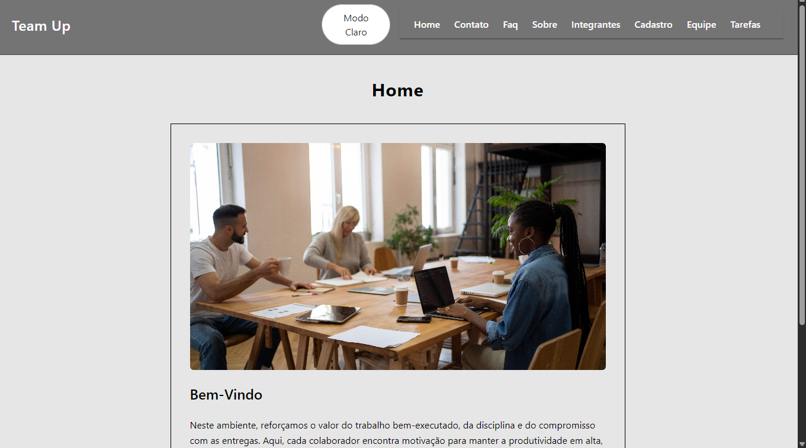
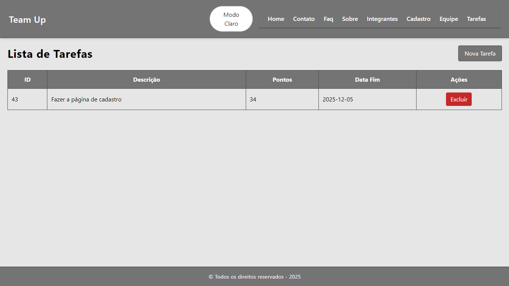
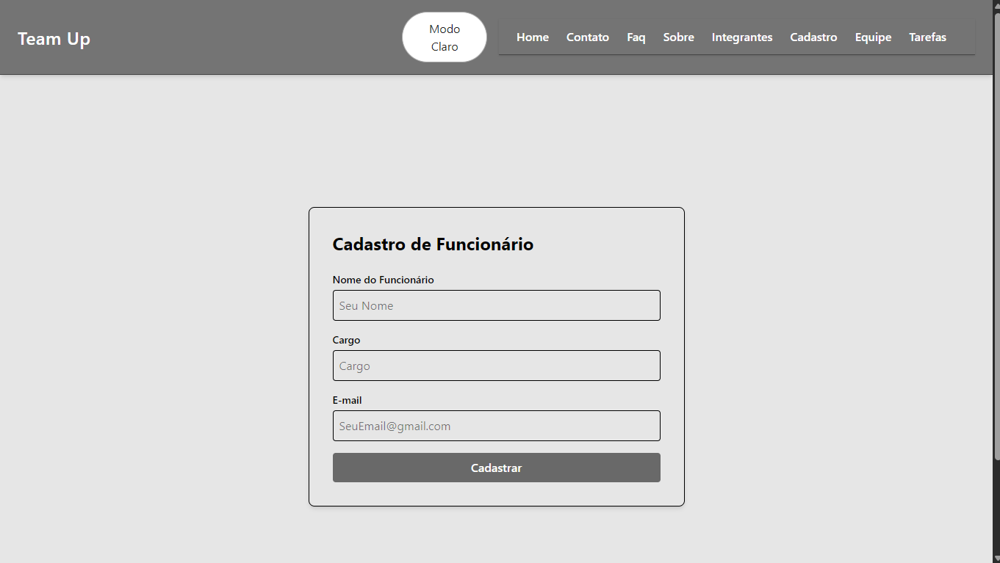
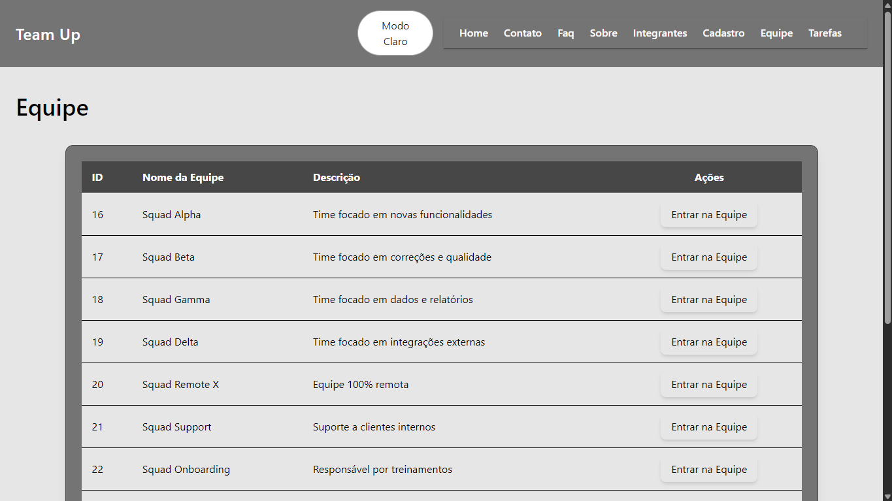

Título: Team Up
Descrição: Ajudar os trabalhadores a ficarem inspírados no trabalho.

Status Do Projeto: Pronto

Sumario:
1.Link Do GitHub
2.Link Do YouTube
3.Link Da Vercel
4.Sobre O Projeto
5.Tecnologias Utilizadas
6.Instalação
7.Como Usar
8.Estrutura De Pastas
9.Endpoints ou Rotas Principais
10.Autores E Creditos
11.Screenshots
12.Contato

1.Link Do GitHub: https://github.com/Felipe-Furlanetto0504/GS-Front-Segundo-Semestre

2.Link Do YouTube: https://youtu.be/TMe_ebP0PgI

3.Link Da Vercel: https://gs-front-felipefurlanetto4-9715-felipe-furlanettos-projects.vercel.app?_vercel_share=pVxWo9FOzUxWVwYaSARRWecPF0tB5yEx

4.Sobre O Projeto: Esse Projeto serve para que as pessoas que trabalham em alguma empresa se sintam mais inpiradas ao realizar seu trabalho, por meio de recompensas, usando os pontos acumulados apos terminar as tarefas.

5.Tecnologias Utilizadas: HTML, CSS, Typescripyt, Tailwindcss, Java, Render, Vercel, GitHub, GitFlow, React, Vite, Node.js, 
Hook-Forms, Houter-Dom.

6.Instalação: Clonar o Projeto pelo GitHub, entrar no vs code, abrir o terminal, dar cd gs-front para entrar na pasta do projeto, dar npm i para instalar as dependencias, apos isso dar npm run dev para rodar o projeto e depois apertar a tecla O para o Projeto aparecer no navegador.

7.Como Usar: Quando abrir o projeto no navegador, voce consiguira ver que no cabeçalho as opções de pagina, home sendo a pagina inicial do projeto, faq se tiver alguma duvida, integrantes para ver quem realizou o projeto, sobre para conhecer mais sobre o projeto, contato para entrar em contato com a empresa team up, cadastro para realizar o cadastro de um novo usuario, equipe para entrar em qualquer equipe e sair quando quiser de qualquer equipe e tarefa para cadastrar novas tarefas os excluir elas apos realizalas.

8.Estrutura De Pastas: Primeiro foi criada a pasta gs-front apos isso dentro dela foi criada outra pasta chamada gs-front que dentro dela contem a node_modules(dependencias do projeto), src que dentro dela contem a components que tem o cabecalho, menu e rodape, img que contem as imagens e icones do projeto, routes que contem as paginas do projeto como cadastro, contato, equipe, error, faq, home, integrantes, sobre e tarefa e por ultimo a pasta types.

9.Endpoints ou Rotas Principais: As rotas principais que são as que mais dão valor ao projeto são cadastro, tarefa e equipe, já os endpoints são /funcionario, /equipe, /equipe/entrar/${id}, /equipe/sair/${equipeAtual}, /tarefa, /tarefa/${id}.

10.Autores E Creditos: Felipe Furlanetto RM 562766 1TDSPF, João Victor Bueno Castelini da Silva RM 564115 1TDSPF e 
João Victor Caetano Alves da Silva RM 562074 1TDSPF. Meus Creditos vão a todos os professore que me ajudaram nessa nossa jornada ao longo do ano e aos nossos familiares.

11.Screenshots: , , 
, 

12.Contato: felipe.furlanetto.4@gmail.com, Jvictorcastelini2006@gmail.com, e joaovictorcaetano1310@gmail.com